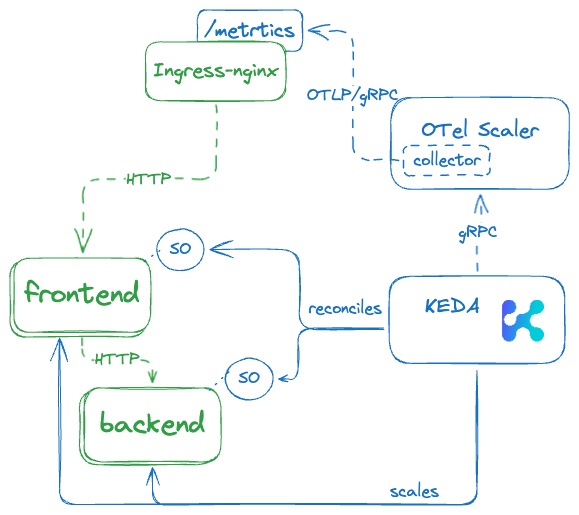

# Setup
1. expose the ingress-nginx metrics endpoint

```
helm upgrade -i nginx-ingress nginx-ingress --reuse-values \
   https://kubernetes.github.io/ingress-nginx \
   --namespace ingress-nginx \
   --set controller.metrics.enabled=true
```

2. install the OTel Scaler
```
helm upgrade -i keda-otel-scaler -nkeda \
 oci://ghcr.io/kedify/charts/otel-add-on \
 --version=v0.1.3 \
 -f ./otel-scaler-values.yaml
```

3. create scaled objects


# Architecture


[## https://excalidraw.com/#json=bMb11limAWMauy_ChBZFb,D-XdxbUT9BR6ZPcLszl5Fw](https://excalidraw.com/#json=VzaunOMs2NXOd_rTVy2yl,RU1vtVumsMIw-PxaUETKKw)